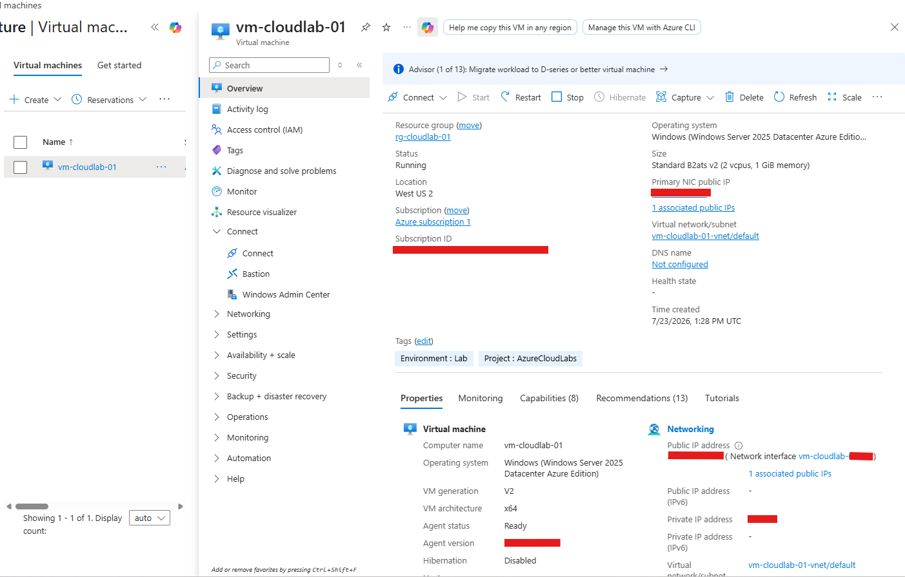
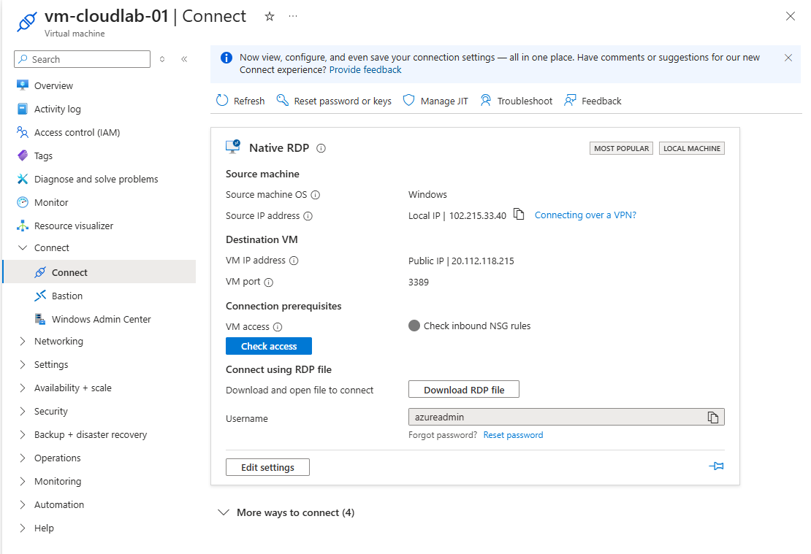
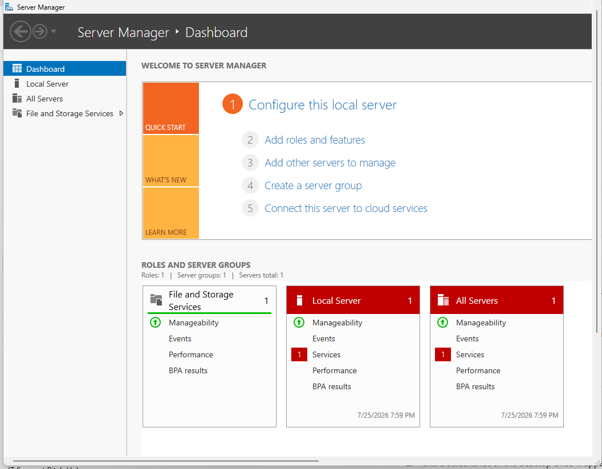

# Lab 02 – Deploy a Windows Server Virtual Machine in Microsoft Azure

## Objective

Deploy a Windows Server 2025 Virtual Machine in Microsoft Azure and configure it for secure remote administration using Remote Desktop Protocol (RDP).

---

## Lab Overview

In this lab, I deployed my first Windows Server Virtual Machine in Microsoft Azure. During the deployment, I configured the networking, storage, authentication, and management settings required to provision a cloud-hosted Windows Server.

After deployment, I connected to the server using Remote Desktop Protocol (RDP) and verified that the virtual machine was functioning correctly.

---

## Azure Resources Used

- Azure Virtual Machine
- Resource Group: **rg-cloudlab-01**
- Windows Server 2025 Datacenter Azure Edition
- Virtual Network (VNet)
- Subnet
- Public IP Address
- Network Security Group (NSG)
- Standard SSD Managed Disk

---

## VM Configuration

| Setting | Value |
|---------|-------|
| VM Name | vm-cloudlab-01 |
| Region | West US 2 |
| Image | Windows Server 2025 Datacenter Azure Edition |
| Size | Standard B2ats v2 |
| Authentication | Username & Password |
| Public Access | RDP (TCP 3389) |
| Auto Shutdown | Enabled (9:00 PM Nairobi Time) |

---

## Deployment Steps

1. Created a Windows Server Virtual Machine.
2. Selected the existing Resource Group.
3. Configured administrator credentials.
4. Allowed inbound RDP access.
5. Configured networking.
6. Enabled Auto Shutdown.
7. Reviewed and validated deployment.
8. Successfully deployed the VM.
9. Downloaded the RDP file.
10. Connected to the server using Remote Desktop.

---

## Skills Learned

- Azure Virtual Machine deployment
- Virtual Networking
- Network Security Groups (NSGs)
- Public IP configuration
- Remote Desktop (RDP)
- Windows Server administration
- Azure VM management
- Auto-shutdown configuration

---

## Challenges Encountered

### 1. Azure Portal Connection Page Failed to Load

**Issue**

The Azure Portal displayed the following error after selecting **Connect**:

```
Failed to load the virtual machine.
ajaxExtended call failed
```

**Cause**

This appeared to be a temporary Azure Portal interface (UI) issue rather than a problem with the VM itself.

**Resolution**

- Refreshed the Azure Portal.
- Reopened the Connect blade.
- The page loaded successfully.

**Lesson Learned**

Not every Azure error indicates a deployment failure. Sometimes the issue is related to the Azure Portal interface, and refreshing the page resolves it.

---

### 2. VM Deployment Failed in East US

**Issue**

During the initial deployment attempt, the selected VM size was unavailable in the **East US** region due to capacity limitations.

**Cause**

Azure regions do not always have the same hardware capacity. Some VM sizes may be temporarily unavailable in a specific region depending on current demand and resource availability.

**Resolution**

- Reviewed the deployment error.
- Changed the deployment region from **East US** to **West US 2**.
- Revalidated the deployment.
- The VM deployed successfully without any further issues.

**Lesson Learned**

Cloud resources are region-dependent. If a VM size is unavailable in one region, selecting another region with available capacity is often the quickest solution. This reinforced the importance of understanding Azure regions and checking resource availability during deployments.

---

### 3. VM Deployment Failed Due to Availability Options

**Issue**

The initial virtual machine deployment failed during validation because the selected configuration was not supported in the chosen Azure region.

**Root Cause**

The selected **Availability options** and VM size combination was not available in the original deployment region.

**Troubleshooting Process**

- Reviewed the Azure validation error.
- Investigated the deployment configuration instead of immediately changing VM size.
- Identified that the **Availability options** setting was contributing to the deployment issue.
- Updated the deployment configuration.
- Changed the deployment region from **East US** to **West US 2**, where the selected configuration was supported.
- Revalidated the deployment.

**Resolution**

The deployment validation passed successfully, and the Windows Server VM was provisioned without further errors.

**Lesson Learned**

Azure VM deployment depends on several factors, including:

- Region availability
- VM size availability
- Availability options
- Azure capacity at the time of deployment

When a deployment fails, reviewing the validation details helps identify the actual cause instead of relying on trial and error.

---

### 4. Auto-Shutdown Time Zone

**Issue**

The VM was initially configured using **UTC** instead of my local time zone.

**Resolution**

Changed the Auto-Shutdown time zone to:

```
UTC+03:00 Nairobi
```

**Lesson Learned**

Always verify time zone settings to ensure scheduled operations occur at the expected local time.

---

### 5. Connecting via Remote Desktop

**Issue**

This was my first time connecting to an Azure Virtual Machine using RDP.

**Resolution**

- Downloaded the RDP file from the Azure Portal.
- Entered the administrator credentials created during deployment.
- Successfully established a remote desktop session.

**Lesson Learned**

Azure generates an RDP configuration file that simplifies secure remote access to Windows virtual machines.

---

## Outcome

- Windows Server Virtual Machine deployed successfully.
- RDP connection established.
- Azure networking configured correctly.
- Auto-shutdown enabled.
- Server ready for administration and future labs.

---

## Screenshots

### Azure VM Deployment Summary



---

### Deployment Successful


---

### Connect to Virtual Machine



---

### Windows Server Desktop



---

## Lessons Learned

- Azure VM sizes are not guaranteed to be available in every region.
- Azure regions can experience temporary capacity constraints.
- Reviewing deployment validation messages helps identify configuration issues quickly.
- Selecting an alternative Azure region can resolve resource availability problems without changing the overall lab objective.
- Azure Virtual Machines require several supporting resources, including Virtual Networks, Public IP addresses, and Network Security Groups.
- RDP provides secure remote administration for Windows Server VMs.
- Auto-Shutdown helps reduce unnecessary cloud costs during lab practice.
- Troubleshooting Azure Portal issues is part of working with cloud platforms and helps build practical problem-solving skills.
